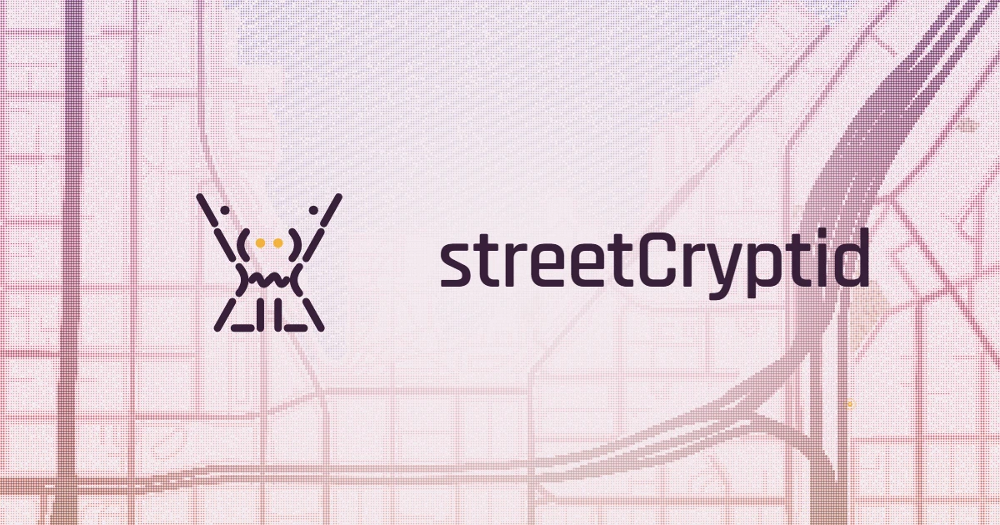
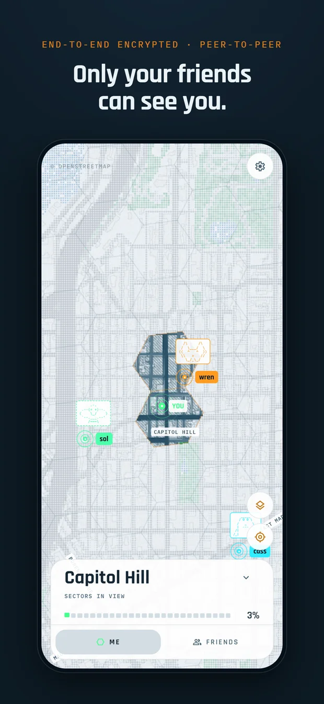
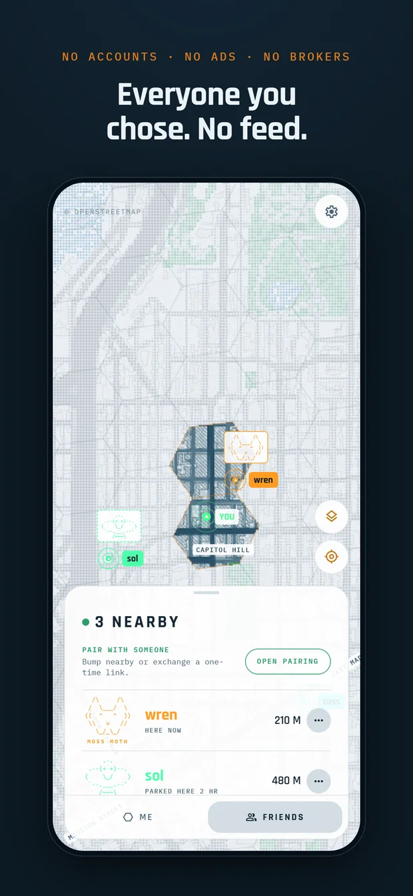
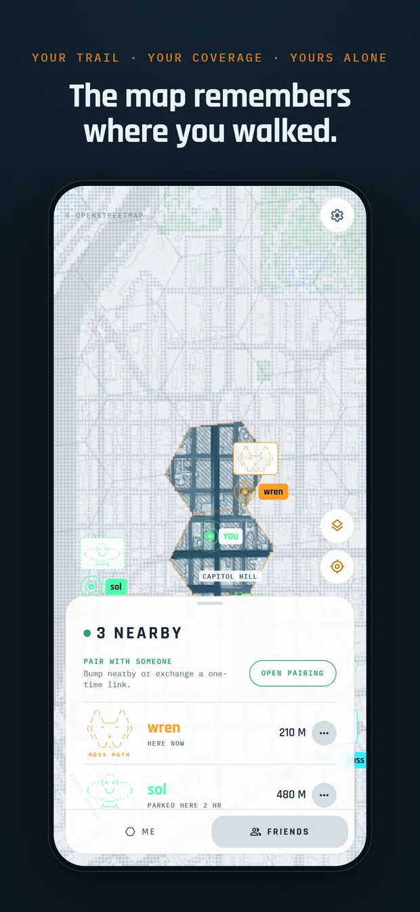
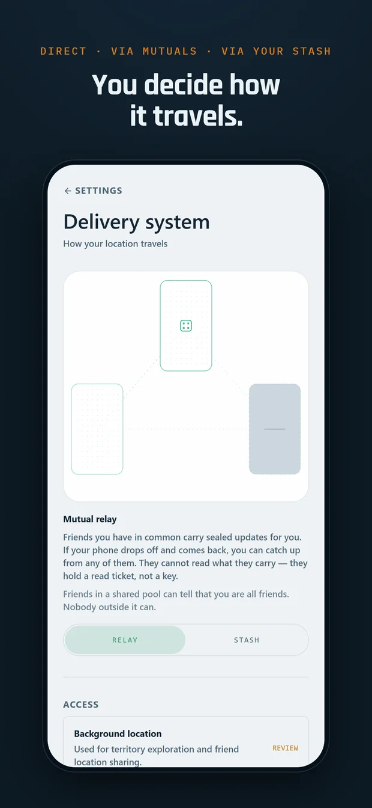

<div align="center">



**A fog-of-war atlas of the city you actually walk — and a friend map that no server can read.**

iOS · Android · Web · [AGPL-3.0](#license) · no accounts, no ads, no brokers ·
every server it touches is one you can run yourself

</div>

<table>
<tr>
<td width="25%"></td>
<td width="25%"></td>
<td width="25%"></td>
<td width="25%"></td>
</tr>
<tr>
<td align="center"><sub>End-to-end encrypted · peer-to-peer</sub></td>
<td align="center"><sub>No accounts · no ads · no brokers</sub></td>
<td align="center"><sub>Your trail · your coverage · yours alone</sub></td>
<td align="center"><sub>Direct · via mutuals · via your stash</sub></td>
</tr>
</table>

<sub>Real captures of the running app, photographed by `just store-shots` — the same build the
stores get, driven through its own controls. The people on the map are fixtures; everything
about them on screen is derived by the shipping code.</sub>

## What it is

streetCryptid is a **"walk every street" fog-of-war map** of the city you live in. As you move
through the world, the map reveals where you've been in discrete **hex sectors**; everywhere you
haven't been stays a desaturated "ghost city." It is a passive **where-you've-been-vs-haven't
atlas — not** a route tracker, trip logger, or fitness app. Success looks like the quiet
satisfaction of watching your city fill in over months, plus a light social layer for comparing
territory with friends.

It runs in the background at a low ping rate, so you are not operating it most of the time; you
open it to _browse_ the territory you have accumulated. A low-battery background ping acquires a
whole sector, so the reveal comes in chunks, not traces. The city is drawn as a field of tiny
dots — calm, precise, instrument-like. See [PRODUCT.md](./PRODUCT.md) for the product register and
[DESIGN.md](./DESIGN.md) for the visual system of record.

## Nobody but your friends can read it

- **End-to-end encrypted, per recipient.** Every fix is sealed on your device individually for each
  friend you share with. Stop sharing with someone and they can no longer open **new** fixes, even
  though the envelopes still travel over a shared channel.
- **No central service.** There is no streetCryptid server that holds your location — there is no
  streetCryptid server at all. Peers talk directly; the infrastructure in the middle only ever
  handles sealed bytes it cannot open.
- **No accounts.** No sign-up, no email, no username, no phone number. You add a friend by tapping
  phones together over Bluetooth, or by exchanging a one-time pairing link.
- **No advertising, no tracking, no data brokers, no analytics SDKs.** The only instrumentation
  that exists is a developer tracing pipeline that has to be compiled in deliberately, and CI
  fails a store build that enables it. (While the app is TestFlight-only, that check carries one
  recorded exception so the background pipeline can be diagnosed — see
  `scripts/check-release-telemetry.mjs`.)
- **Forward secrecy.** Sharing runs over a Double Ratchet, so a seized phone or an archived stash
  does not retroactively open the trail — see [docs/social/FORWARD-SECRECY.md](docs/social/FORWARD-SECRECY.md)
  for the threat model and [docs/social/POST-QUANTUM.md](docs/social/POST-QUANTUM.md) for where the
  primitives are going.
- **Even the map server is kept ignorant.** Detailed tiles are fetched as complete z10 bundles, so
  the tile host learns the district you are somewhere inside and never which tile you are actually
  looking at ([docs/map-stream-protocol.md](docs/map-stream-protocol.md)).

The full, plain-language version is [docs/privacy-policy.md](docs/privacy-policy.md).

## How your location travels

You choose the route in **Settings → Delivery system**, and the app tells you what each one costs
you in plain words:

| Route              | What happens                                                                                                                                     |
| ------------------ | ------------------------------------------------------------------------------------------------------------------------------------------------ |
| **Direct**         | Phone to phone over QUIC — on the same Wi-Fi, or across the internet with a relay used only for NAT traversal, which cannot read the connection. |
| **Via mutuals**    | Friends you have in common carry sealed updates for you, so you can catch up from any of them. They hold a read ticket, not a key.               |
| **Via your stash** | An always-on, ciphertext-blind replica holds sealed updates so a friend receives your trail even when your phones are never online together.     |

Offline delivery through a stash is opt-in and off until you turn it on. The architecture contract
for all of it — identities, the per-recipient envelope, gossip vs. durable reconciliation — is
[docs/social/ARCHITECTURE.md](docs/social/ARCHITECTURE.md).

## The servers, and running your own

streetCryptid has no home server, which means every endpoint it talks to is a deployment decision
rather than a deployment of ours. Two of the four below are our own open-source servers; all of
them are replaceable, and the stash can be left out entirely.

| Piece               | What it does                                                                                              | What it can read                                  | Where it comes from                                                                                     |
| ------------------- | --------------------------------------------------------------------------------------------------------- | ------------------------------------------------- | ------------------------------------------------------------------------------------------------------- |
| **Map server**      | Serves the base map: coarse XYZ tiles plus the privacy-quantized z10 bundles the detailed view streams.   | Which z10 district you are somewhere inside.      | [unrealJune/streetCryptid-map-server](https://github.com/unrealJune/streetCryptid-map-server)           |
| **Trail stash**     | Stateless iroh-docs replica + push-to-sync waker, for delivery when both phones are never awake together. | Nothing. Ciphertext-blind by construction.        | [unrealJune/trail-stash](https://github.com/unrealJune/trail-stash) — Docker image + Helm chart on GHCR |
| **iroh relay**      | NAT traversal when a direct path can't be found.                                                          | Nothing. Relay-blind QUIC.                        | Any [iroh](https://iroh.computer) relay, including your own.                                            |
| **Pairing mailbox** | A one-time, short-lived KV that hands over an already-sealed pairing capsule.                             | Nothing. The capsule is sealed before it arrives. | Any KV endpoint implementing the tiny contract in `src/features/social/net/pairing-mailbox.ts`.         |

The endpoints are build-time `EXPO_PUBLIC_*` values — see [.env.example](./.env.example), which
documents each one, and note that the trail stash is disabled outright if its URL and ticket are
unset. So whoever builds the app picks the infrastructure; a community, a festival, or one person
with a VPS can each run the whole stack for themselves, and the map server bootstraps its own
signed tile data.

## Tech stack

| Piece            | Choice                                                                                                                      |
| ---------------- | --------------------------------------------------------------------------------------------------------------------------- |
| Framework        | [Expo](https://expo.dev) SDK **57**                                                                                         |
| Native runtime   | React Native **0.86** (New Architecture, on)                                                                                |
| UI runtime       | React **19.2** (React Compiler enabled)                                                                                     |
| Routing          | [expo-router](https://docs.expo.dev/router/introduction) (file-based, typed routes)                                         |
| Language         | TypeScript **6** (strict)                                                                                                   |
| Networking core  | Rust — [iroh](https://iroh.computer) 1.0 + iroh-gossip + iroh-docs and the envelope crypto, in `modules/iroh-location/rust` |
| Native bridge    | UniFFI (Swift + Kotlin) behind an Expo Module; bindings are regenerated by CI                                               |
| Map rendering    | A Skia dot-field engine (CanvasKit on web) over vector tiles, with H3 sectors for exploration                               |
| On-device store  | expo-sqlite (trail, outbox, exploration, telemetry journal)                                                                 |
| Package manager  | [bun](https://bun.sh)                                                                                                       |
| Task runner      | [just](https://github.com/casey/just)                                                                                       |
| Build/distribute | GitHub Actions + [EAS](https://docs.expo.dev/eas/) (`eas.json`), built on GitHub runners                                    |
| Lint / format    | ESLint 9 (`eslint-config-expo`) + Prettier                                                                                  |

## Prerequisites

- **Node.js** — LTS (≥ 20) recommended. Anything ≥ 18.13 works.
- **bun** ≥ 1.3 — `bun --version`
- **just** — `just --version` (install: https://github.com/casey/just)
- For local **Android** native builds: Android SDK + JDK 17+, Rust, and `cargo-ndk`
  (`ANDROID_HOME` set).
- For local **iOS** native builds: macOS + Xcode. On Windows/Linux, build iOS via
  EAS or run in [Expo Go](https://expo.dev/go).

## Getting started

```bash
bun install      # or: just install
just start       # start the Metro dev server
```

Then press `a` (Android), `i` (iOS, macOS only), or `w` (web) in the terminal.
The decentralized friend layer and BLE pairing require a custom development
client; Expo Go does not include the local `iroh-location` native module.

> First run of `just start` also generates the Expo type files
> (`expo-env.d.ts`, `.expo/types/`). These are git-ignored, so run the dev server
> once before `just typecheck` on a fresh clone.

Copy [.env.example](./.env.example) to `.env.local` and point it at reachable deployments before
the first build — the defaults are placeholders, and these values are inlined at bundle time, so an
already-built app cannot be repointed without rebuilding it.

### Local iOS development

The custom `iroh-location` module means iOS uses a development build rather than Expo Go. Install
Xcode with a simulator runtime, CocoaPods, and current stable Rust, then build the UniFFI
XCFramework before the first Expo build:

```bash
rustup target add aarch64-apple-ios aarch64-apple-ios-sim
just bindgen-ios
just run-ios
```

After the development client is installed, use `just start` for JavaScript/TypeScript changes.
Re-run `just bindgen-ios` and `just run-ios` after changing Rust or other native code.

EAS builds automatically load the remote environment selected by their profile in `eas.json`.
For a development client, Metro creates the JavaScript bundle locally, so pull the matching
environment into the ignored `.env.local` file before starting Metro in a fresh worktree:

```bash
just env-pull development
just start
```

### Local Android Development

```bash
# use recommended android studio java (linux)
# add these to your .*rc file
export JAVA_HOME=/opt/android-studio/jbr
export PATH="$JAVA_HOME/bin:$PATH"

rustup target add aarch64-linux-android armv7-linux-androideabi x86_64-linux-android
just bindgen-android
just run-android
```

## Common tasks

Run `just` (or `just --list`) to see everything. Highlights:

```bash
just start           # dev server (a/i/w to open a platform)
just android         # open on Android device / emulator
just web             # open in the browser

just check           # typecheck + lint + format-check + tests (the local gate)
just typecheck       # tsc --noEmit
just lint            # eslint
just lint-fix        # eslint --fix
just format          # prettier --write

just doctor          # expo-doctor health check
just deps-check      # verify deps match the Expo SDK
just deps-fix        # align deps to the Expo SDK
just env-pull        # pull the EAS development environment into .env.local
just bindgen-ios     # rebuild the iOS Rust XCFramework + Swift bindings
just bindgen-android # rebuild the Android Rust libraries + Kotlin bindings

just build ios              # EAS build (defaults: android / preview)
just build android production
just build-dev             # installable development client
just submit ios app.ipa    # send a built archive to the store (no EAS Submit)
just update "message"      # publish an OTA update
just store-shots           # photograph the real app for the store listings
```

EAS pre-install hooks rebuild the git-ignored Rust artifacts for both Android and iOS, so local
and cloud EAS builds always package the native code that matches the committed UniFFI bindings.

### Debugging dropped location pings (developer telemetry)

Dev and preview builds can export OpenTelemetry traces + logs from every component (app JS,
native iroh core, trail-stash server) to a self-hosted collector, correlated across devices by
envelope hash. `docker compose up -d` in `infra/otel/`, set `EXPO_PUBLIC_OTEL_ENDPOINT` in
`.env.local`, and see [infra/otel/README.md](infra/otel/README.md) for the
"follow one ping" cookbook.

Without `EXPO_PUBLIC_DEV_TELEMETRY=1` the entire graph — encoder, shipper, SQLite journal, console
bridge — is resolved away by `metro.config.js` and is not in the bundle at all, and
`scripts/check-release-telemetry.mjs` fails CI if a store profile sets it. The `production` profile
currently holds the one acknowledged exception to that rule, deliberately and temporarily, because
production _is_ TestFlight for this app right now; deleting that entry re-arms the check.

## Project structure

```
src/
  app/            # expo-router routes (map + settings modal)
  features/map/   # dot-field map engine, rendering, and tests
  features/social/ # P2P pairing, encrypted location sync, profiles, and UI
  features/account/ # local cryptid identity and ASCII profile editor
  components/     # shared UI components (themed text/view, icons, ...)
  constants/      # theme tokens
modules/
  iroh-location/  # the Expo Module: Rust core, UniFFI bindings, Swift/Kotlin glue
assets/           # icons, splash, images, marketing art
docs/             # architecture, privacy, protocol, design archive
infra/otel/       # self-hosted collector + dashboards for developer telemetry
scripts/          # build profiling, store screenshots, submission, bindgen
store/            # generated App Store / Play listing screenshots
app.json          # Expo app config (name, scheme, bundle ids, plugins)
eas.json          # EAS build/submit profiles (development / preview / production)
eslint.config.js  # ESLint flat config (expo + prettier)
justfile          # developer task runner
```

Path alias: `@/*` → `src/*`, `@/assets/*` → `assets/*`.

## Documentation

| Document                                                         | What it covers                                                        |
| ---------------------------------------------------------------- | --------------------------------------------------------------------- |
| [PRODUCT.md](./PRODUCT.md)                                       | Product register: users, purpose, brand, anti-references              |
| [DESIGN.md](./DESIGN.md)                                         | Visual system of record (the design archive is in `docs/design/`)     |
| [docs/social/ARCHITECTURE.md](docs/social/ARCHITECTURE.md)       | Decentralized, E2E-encrypted location sharing — the security contract |
| [docs/social/FORWARD-SECRECY.md](docs/social/FORWARD-SECRECY.md) | Threat model and the ratchet schedule                                 |
| [docs/social/POST-QUANTUM.md](docs/social/POST-QUANTUM.md)       | Where the primitives are headed                                       |
| [docs/map-stream-protocol.md](docs/map-stream-protocol.md)       | SCB2 tile streams, and what the map server is allowed to learn        |
| [docs/map-performance.md](docs/map-performance.md)               | Map engine performance budget and measurements                        |
| [docs/privacy-policy.md](docs/privacy-policy.md)                 | The published privacy policy                                          |
| [docs/mesh/DESIGN.md](docs/mesh/DESIGN.md)                       | Festival mesh hardware design of record                               |
| [docs/release-engineering.md](docs/release-engineering.md)       | How a commit becomes a release, and how PR builds are made            |
| [infra/otel/README.md](infra/otel/README.md)                     | Telemetry span map, join keys, and the TraceQL cookbook               |
| [AGENTS.md](./AGENTS.md)                                         | The conventions and hard-won constraints to read before changing code |

## Building & shipping

Every push to `main` that passes CI cuts a version, builds both store archives on GitHub-hosted
runners with `eas build --local` (no cloud build quota), and uploads them — iOS to TestFlight with
`fastlane pilot`, Android to the Play internal track through the Play Developer API. Neither binary
nor either store credential passes through Expo. PRs from allow-listed authors build installable
iOS and Android apps and post install links to a Discord thread.

The full account — version derivation, the cache topology, the credential-isolation rules and the
tests that enforce them — is in [docs/release-engineering.md](docs/release-engineering.md).

## License

Copyright (C) 2026 June Philip and the streetCryptid contributors.

This program is free software: you can redistribute it and/or modify it under
the terms of the GNU Affero General Public License as published by the Free
Software Foundation, either version 3 of the License, or (at your option) any
later version.

This program is distributed in the hope that it will be useful, but WITHOUT ANY
WARRANTY; without even the implied warranty of MERCHANTABILITY or FITNESS FOR A
PARTICULAR PURPOSE. See the GNU Affero General Public License for more details.

You should have received a copy of the GNU Affero General Public License along
with this program. If not, see <https://www.gnu.org/licenses/>.

The full license text is in [LICENSE](./LICENSE); the SPDX identifier is
`AGPL-3.0-or-later`. Vendored third-party components keep their own upstream
copyright holders — see [THIRD_PARTY_NOTICES.md](./THIRD_PARTY_NOTICES.md).

Because the app links AGPL code, anyone you distribute a build to (TestFlight
and Play testers included) is entitled to the corresponding source for that
build. `app.config.ts` stamps the commit into every build, which is what makes
that answerable.

Map data is © OpenStreetMap contributors.
