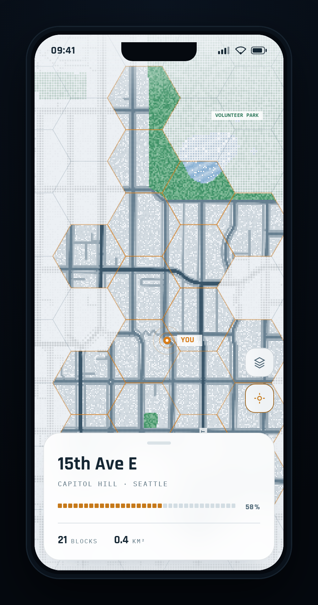
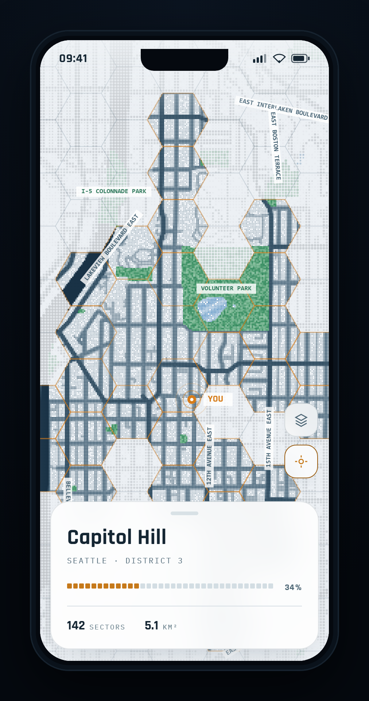
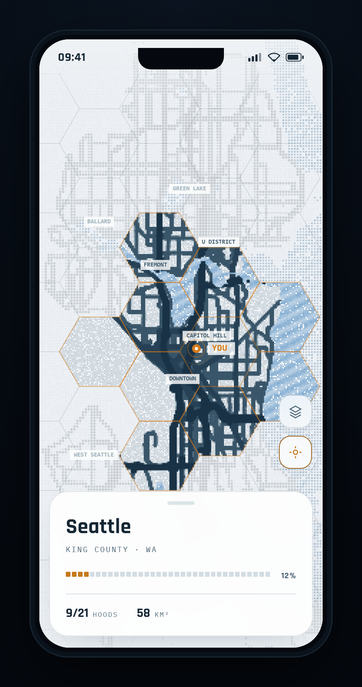
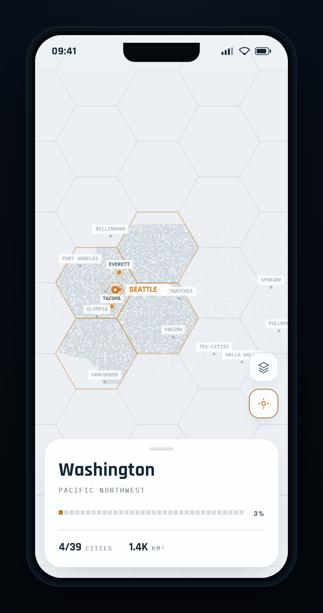
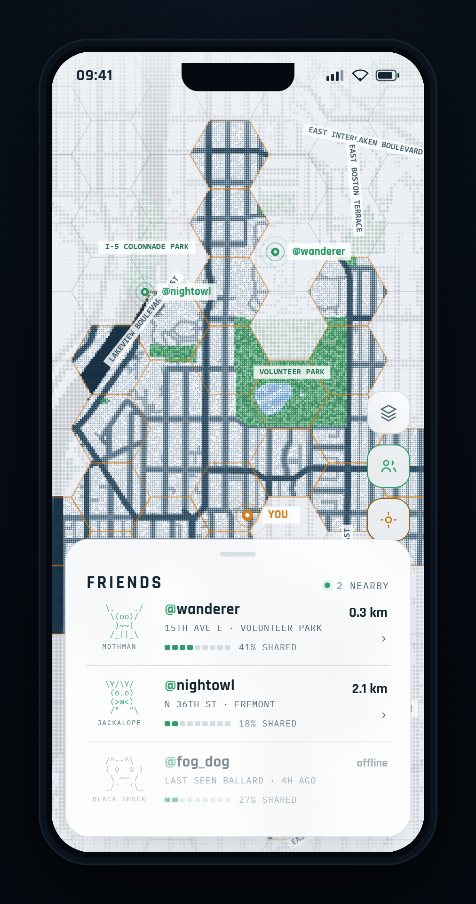
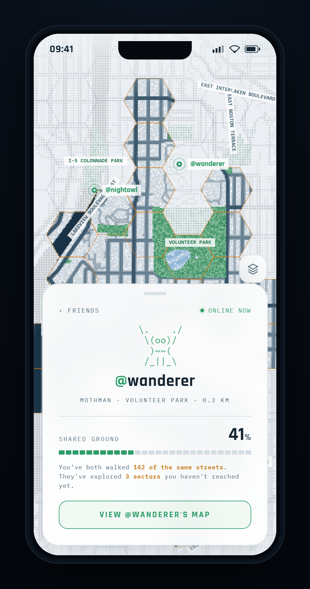

# streetCryptid — design archive

This folder is the **working reference implementation** of the streetCryptid visual
system: standalone HTML/`<canvas>` mockups plus the real OpenStreetMap data they render
and a curated set of PNG renders. It is **reference material, not app code** — the Expo
app under `src/` is the real product. Start with [`../../PRODUCT.md`](../../PRODUCT.md)
and [`../../DESIGN.md`](../../DESIGN.md) for the "why"; this README is the "how to run it."

> Excluded from `eslint` / `prettier` (see `.prettierignore`, `eslint.config.js`) because
> the baked OSM data files are multi-megabyte single-line blobs.

## Open it

No build step — open a file URL in Chrome and drive it with query params:

```
file:///Z:/CopilotApp/streetCryptid/docs/design/mock_social.html?theme=daybreak&zoom=hood&social=roster
```

`mock_social.html` is canonical (map + zoom tiers + themes + the social layer).
`mock_real.html` is the same base map **without** friends.

### Parameters

| Param     | Values                                        | Default    | Notes                                        |
| --------- | --------------------------------------------- | ---------- | -------------------------------------------- |
| `theme`   | `daybreak` · `deepsea` · `nocturne`           | `daybreak` | Light is default. Drives chrome **and** canvas. |
| `zoom`    | `street` · `hood` · `city` · `region`         | `hood`     | Scope + island retitle; coverage drops outward. |
| `fog`     | `hex` · `soft` · `grid`                       | `hex`      | Reveal model. `hex` = sector chunks (canonical). |
| `social`  | `roster` · `profile`                          | `roster`   | `mock_social.html` only.                     |
| `who`     | `wanderer` · `nightowl` · `fog_dog`           | first      | Which friend the `profile` view shows.       |
| `data`    | `caphill` · `greenlk` · `union` · `core`      | per-zoom   | Which OSM geography to render.               |

## Renders (`renders/`)

The **`-light` (daybreak) set is primary**; `-dark` is the deep-sea alternate.

**Zoom tiers — light (default):**






**Social — light (default):**




Dark equivalents: `zoom-*-dark.png`, `social-*-dark.png`.

## Files

| File                       | What it is                                                        |
| -------------------------- | ----------------------------------------------------------------- |
| `mock_social.html`         | Canonical mockup: map engine, 4 zoom tiers, 3 themes, social layer. |
| `mock_real.html`           | Base map + zoom, no friends.                                       |
| `mapdata.js`               | `window.OSMSETS` — baked multi-geography OSM (caphill/greenlk/union/core). |
| `zoomdata.js`              | `window.OSMZOOM` — baked per-zoom-tier OSM.                        |
| `build_sets.mjs`           | Regenerates `mapdata.js` (Overpass fetch + transform + relation ring-stitch). |
| `build_zoom.mjs`           | Regenerates `zoomdata.js`.                                         |
| `renders/`                 | Curated PNGs (light primary, dark alt).                            |

## Regenerate the OSM data

The scripts hit the Overpass API and rewrite the baked `*.js` in place. Node lives at
`Z:\nodejs\node.exe` (not always on PATH):

```powershell
Z:\nodejs\node.exe build_sets.mjs .   # -> mapdata.js
Z:\nodejs\node.exe build_zoom.mjs .   # -> zoomdata.js
```

## Re-render a PNG (headless Chrome)

```powershell
& "C:\Program Files\Google\Chrome\Application\chrome.exe" `
  --headless=new --disable-gpu --hide-scrollbars --force-device-scale-factor=2 `
  --virtual-time-budget=22000 --user-data-dir="$env:TEMP\cr_$(Get-Random)" `
  --window-size=506,960 --screenshot="renders\out.png" `
  "file:///Z:/CopilotApp/streetCryptid/docs/design/mock_social.html?theme=daybreak&zoom=hood&social=roster"
```

## Next: translating to the Expo app

When porting into `src/`: read the exact Expo SDK 57 docs first
(https://docs.expo.dev/versions/v57.0.0/). Put the `THEME` object into
`src/constants/theme.ts` with **daybreak/light as the default color scheme** (auto-switch
to a dark theme with the OS). Keep the one-accent-per-role discipline, the hex-sector
reveal, and the accessibility TODOs (canvas text model, reduced motion, GPS/permission
empty states) called out in `PRODUCT.md`.
