# streetCryptid — design archive

This folder is the **working reference implementation** of the streetCryptid visual
system: standalone HTML/`<canvas>` mockups plus the real OpenStreetMap data they render
and a curated set of PNG renders. It is **reference material, not app code** — the Expo
app under `src/` is the real product. Start with [`../../PRODUCT.md`](../../PRODUCT.md)
and [`../../DESIGN.md`](../../DESIGN.md) for the "why"; this README is the "how to run it."

> Excluded from `eslint` / `prettier` (see `.prettierignore`, `eslint.config.js`) because
> the baked OSM data files are multi-megabyte single-line blobs.

## Open it

No build step — open a file URL in Chrome and drive it with query params:

```
file:///Z:/CopilotApp/streetCryptid/docs/design/mock_chrome.html?theme=daybreak&zoom=hood&island=friends
```

`mock_chrome.html` is **canonical**: it mirrors the shipped app chrome — no tab bar, a
settings FAB top-right, street/park name labels gated by zoom, and one island over the map
carrying its own ME / FRIENDS segmented bar (the app's only navigation). Only map
affordances float: layers and locate.

`mock_roads.html` is a **road-width lab** — see [Road width lab](#road-width-lab) below.

`mock_social.html` is the earlier tab-era study (kept for the shared-ground bar and the
full-screen profile view). `mock_real.html` is the same base map **without** friends.

### Parameters

| Param      | Values                                        | Default    | Notes                                        |
| ---------- | --------------------------------------------- | ---------- | -------------------------------------------- |
| `theme`    | `daybreak` · `deepsea` · `nocturne`           | `daybreak` | Light is default. Drives chrome **and** canvas. |
| `zoom`     | `street` · `hood` · `city` · `region`         | `hood`     | Scope + island retitle; coverage drops outward. Also gates which **street names** are drawn. |
| `fog`      | `hex` · `soft` · `grid`                       | `hex`      | Reveal model. `hex` = sector chunks (canonical). |
| `data`     | `caphill` · `greenlk` · `union` · `core`      | per-zoom   | Which OSM geography to render.               |
| `island`   | `me` · `friends`                              | `friends`  | `mock_chrome.html` only. Which tab of the island's segmented bar is lit (`coverage` is kept as an alias for `me`). |
| `me`       | any `#rrggbb`                                 | `#2F9E6A`  | `mock_chrome.html` only. Your profile signal colour — drives the YOU locator, the coverage bar, the ME glyph and the identity row. |
| `bump`     | `idle` · `armed` · `searching` · `failed` · `off` | `idle`     | `mock_chrome.html` only. Pairing strip state inside the FRIENDS tab. `idle` is the resting state and offers ARM BUMP. |
| `settings` | `open`                                        | closed     | `mock_chrome.html` only. Pulls the settings sheet over the map. |
| `social`   | `roster` · `profile`                          | `roster`   | `mock_social.html` only.                     |
| `who`      | `wanderer` · `nightowl` · `fog_dog`           | first      | `mock_social.html` only — which friend `profile` shows. |

### Label level-of-detail

`mock_chrome.html` reproduces the app's three label gates so you can sanity-check them
by eye: a **class tier** (`motorway → residential` each earn a name at a different zoom),
a **fit** gate (the name must be shorter than the visible run of the way), and greedy
**collision** rejection. Compare `zoom=street` (residential names appear) against
`zoom=hood` (arterials only).

## Road width lab

`mock_roads.html` exists to answer one question: *why does the map go grey at some zooms,
and which stroke-width policy fixes it?* It renders the same real OSM geography through a
faithful copy of the shipped pipeline — `core/road-lod.ts` widths/taper/cut-offs,
`core/masks.ts` brightness ladder, round-capped max-blended strokes from
`render/mask-image.ts`, and the dot field's `DOT_STEP = 2`, 5-tap `sampleMax` and
`sv > 28` street test from `render/dot-field-shader.ts` — once per policy per zoom.

Each panel carries a **COV** badge: the share of lattice dots the mask classifies as road.
That is the grey-out number. Roughly: under 40% reads as streets on ground, ~40–55% reads
as a dense but legible grid, and over 55% the field has merged into a lit surface.

```
mock_roads.html?theme=daybreak&data=caphill&zooms=12,13,14,15
mock_roads.html?theme=deepsea&data=union&zooms=11,12,13,14&tweak=on
```

| Param   | Values                                      | Default       | Notes                                              |
| ------- | ------------------------------------------- | ------------- | -------------------------------------------------- |
| `theme` | `daybreak` · `deepsea` · `nocturne`         | `daybreak`    | Same palettes as the other mocks.                   |
| `data`  | `caphill` · `union` · `greenlk` · `core`    | `caphill`     | `caphill`/`union` carry all five road classes.      |
| `zooms` | comma-separated build zooms                  | `12,13,14,15` | One column per zoom. Below z14 panels are magnified nearest-neighbour, never re-scaled. |
| `tweak` | `off` · `on`                                | `off`         | Adds a live row driven by sliders, with a copy-paste `road-lod.ts` block underneath. |

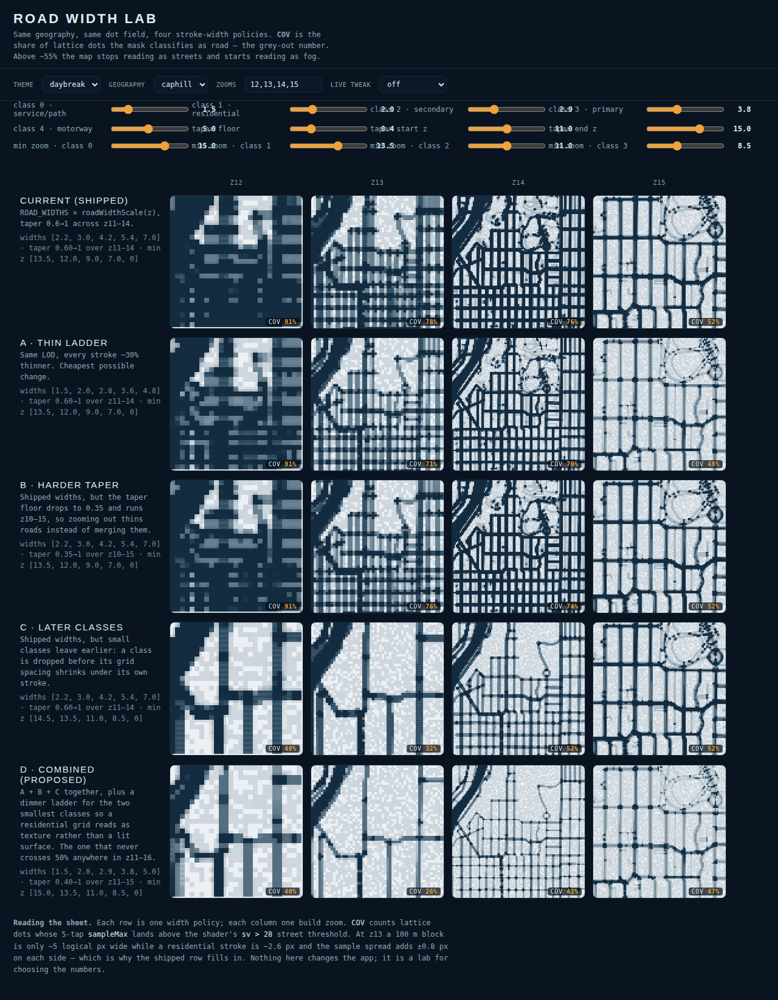
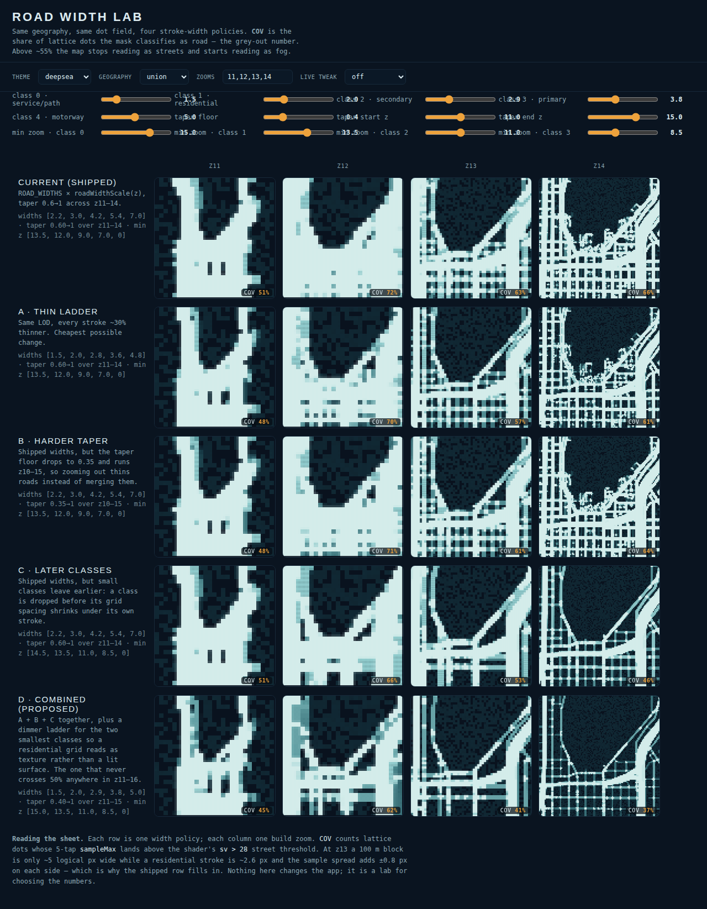

## Renders (`renders/`)

The **`-light` (daybreak) set is primary**; `-dark` is the deep-sea alternate.

**App chrome (current) — light:**

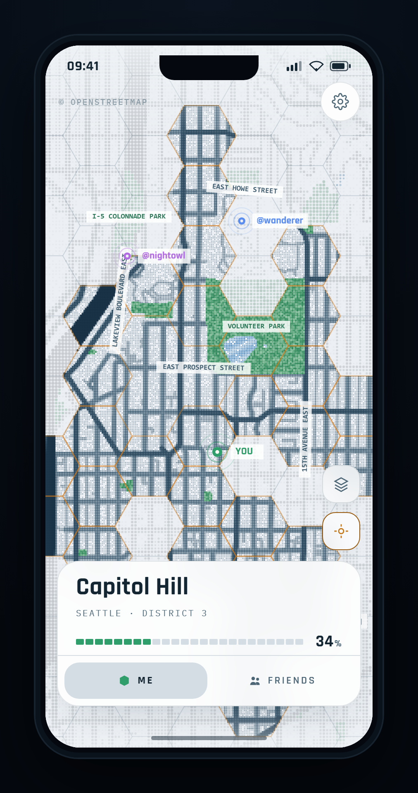
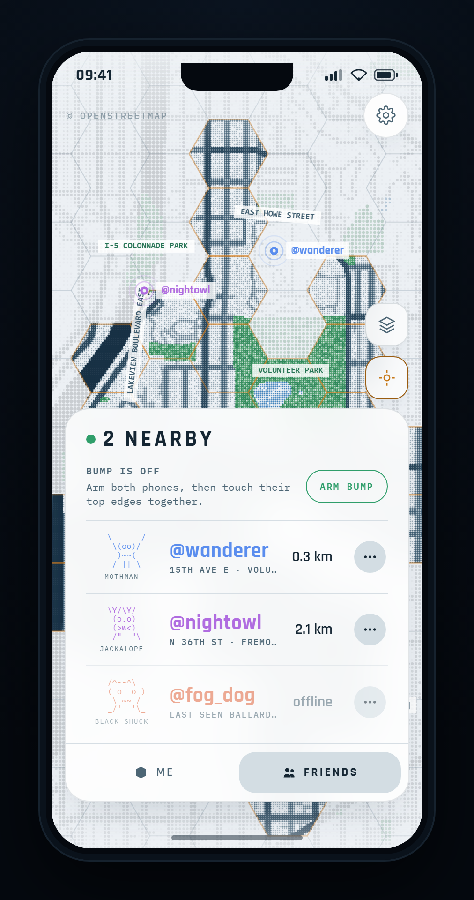
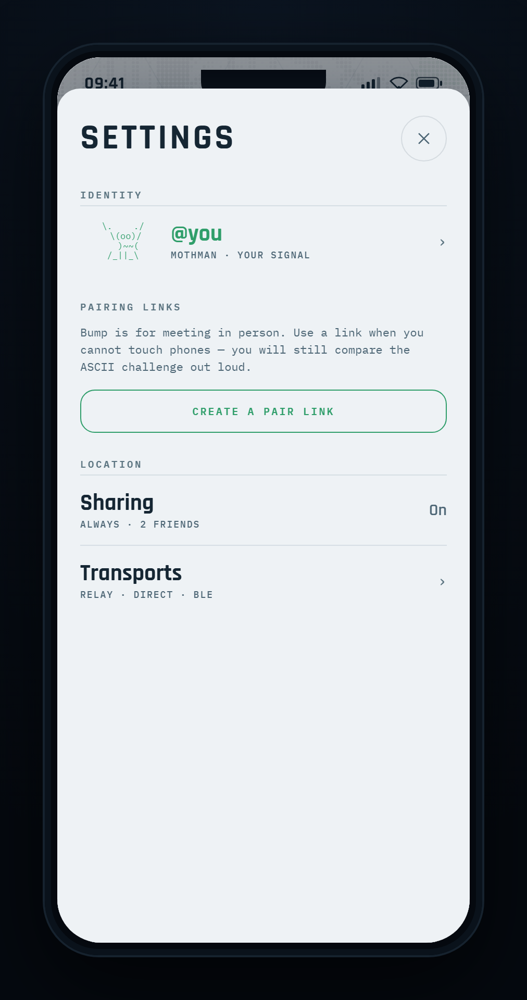
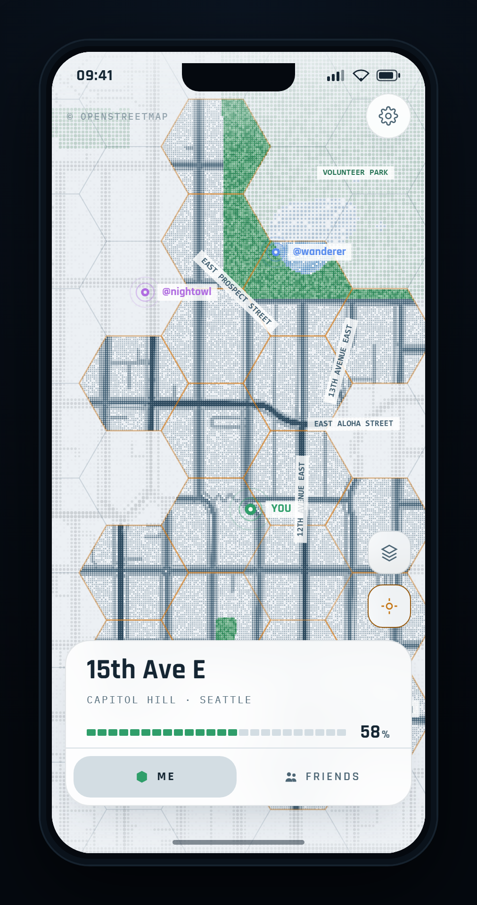

**Zoom tiers — light (default):**

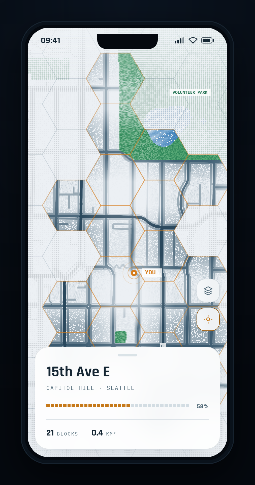
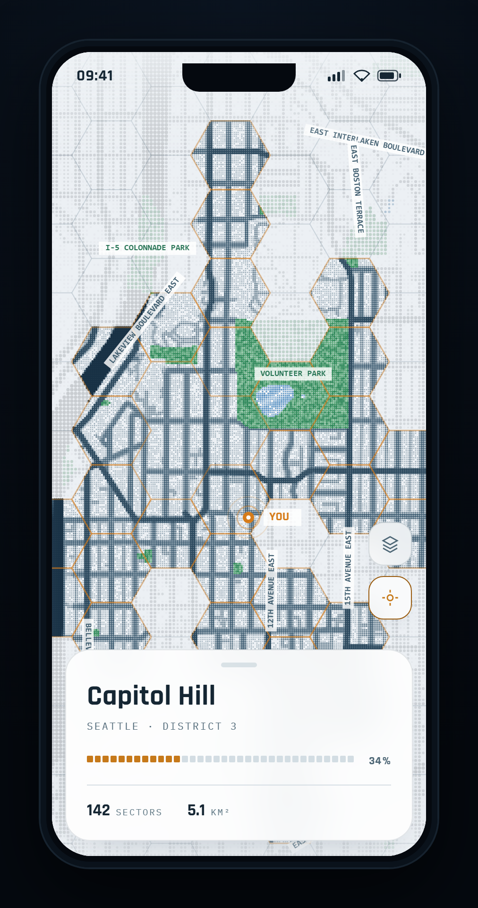
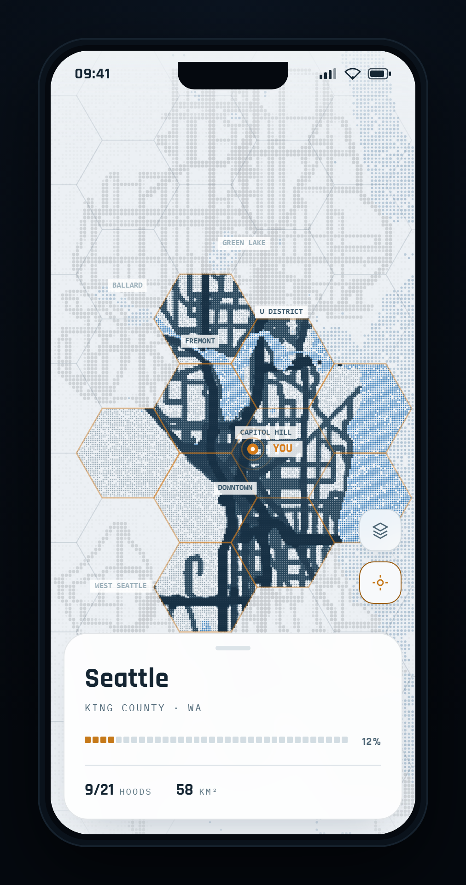
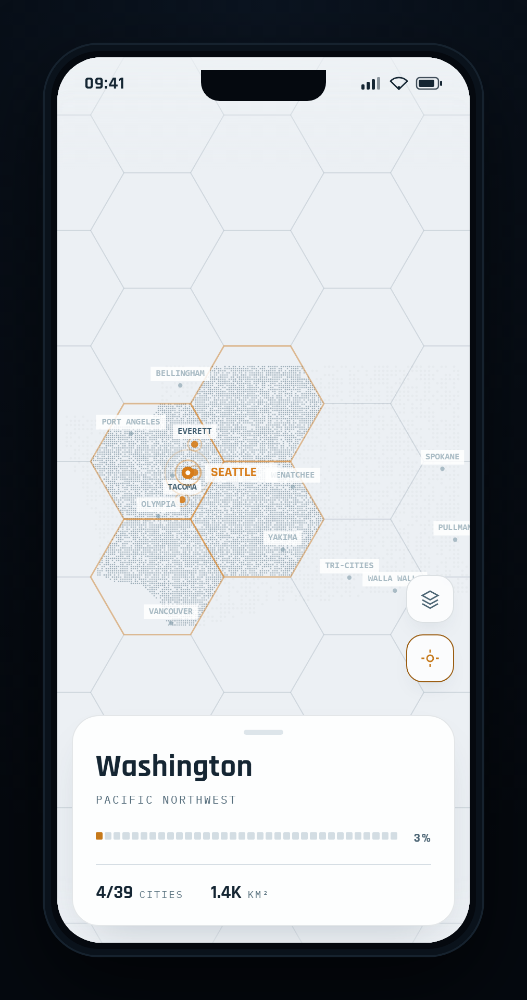

**Social (tab-era study) — light (default):**

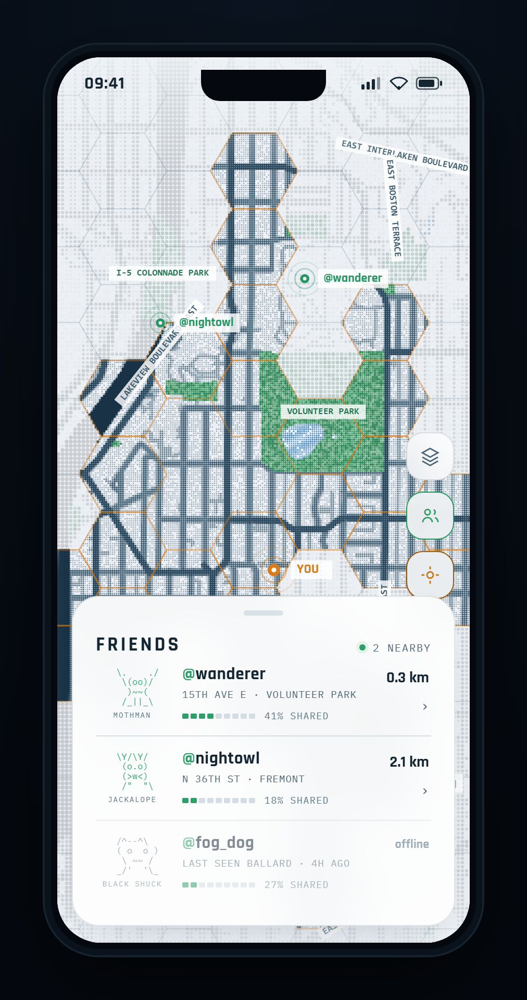
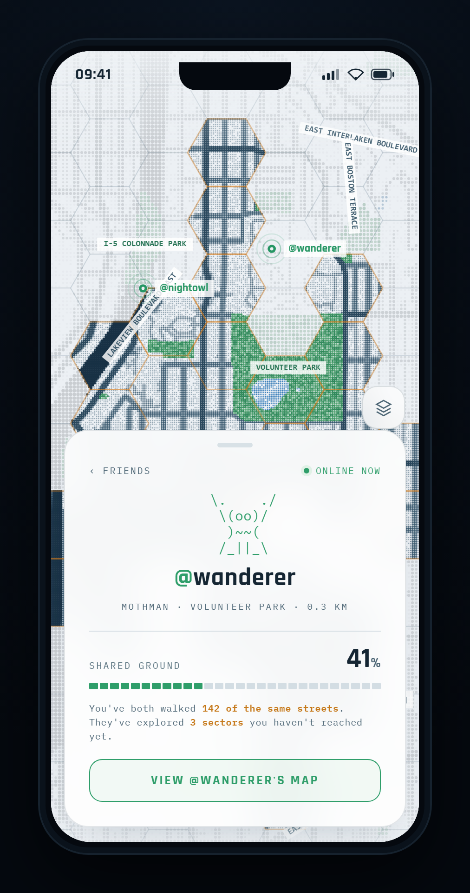

Dark equivalents: `chrome-{1,2}-*-dark.png`, `zoom-*-dark.png`, `social-*-dark.png`.

## Files

| File                       | What it is                                                        |
| -------------------------- | ----------------------------------------------------------------- |
| `mock_chrome.html`         | **Canonical**: the shipped chrome — no tab bar, settings FAB, zoom-gated street labels, one island with a ME / FRIENDS segmented bar and bump pairing. |
| `mock_social.html`         | Tab-era study: map engine, 4 zoom tiers, 3 themes, social layer, shared-ground bar. |
| `mock_real.html`           | Base map + zoom, no friends.                                       |
| `mock_roads.html`          | Road width lab: stroke-width policies × build zooms, with a COV (grey-out) score and live sliders. |
| `mapdata.js`               | `window.OSMSETS` — baked multi-geography OSM (caphill/greenlk/union/core). |
| `zoomdata.js`              | `window.OSMZOOM` — baked per-zoom-tier OSM.                        |
| `build_sets.mjs`           | Regenerates `mapdata.js` (Overpass fetch + transform + relation ring-stitch). |
| `build_zoom.mjs`           | Regenerates `zoomdata.js`.                                         |
| `renders/`                 | Curated PNGs (light primary, dark alt).                            |

## Regenerate the OSM data

The scripts hit the Overpass API and rewrite the baked `*.js` in place. Run them
from this directory with Node on your `PATH`:

```powershell
node build_sets.mjs .   # -> mapdata.js
node build_zoom.mjs .   # -> zoomdata.js
```

## Re-render a PNG (headless Chrome)

```powershell
& "C:\Program Files\Google\Chrome\Application\chrome.exe" `
  --headless=new --disable-gpu --hide-scrollbars --force-device-scale-factor=2 `
  --virtual-time-budget=22000 --user-data-dir="$env:TEMP\cr_$(Get-Random)" `
  --window-size=506,960 --screenshot="Z:\CopilotApp\streetCryptid\docs\design\renders\out.png" `
  "file:///Z:/CopilotApp/streetCryptid/docs/design/mock_chrome.html?theme=daybreak&zoom=hood&island=friends"
```

`--screenshot` must be an **absolute** path — Chrome silently writes nothing (exit 0)
for a relative one.

## Next: translating to the Expo app

When porting into `src/`: read the exact Expo SDK 57 docs first
(https://docs.expo.dev/versions/v57.0.0/). Put the `THEME` object into
`src/constants/theme.ts` with **daybreak/light as the default color scheme** (auto-switch
to a dark theme with the OS). Keep the one-accent-per-role discipline, the hex-sector
reveal, and the accessibility TODOs (canvas text model, reduced motion, GPS/permission
empty states) called out in `PRODUCT.md`.
